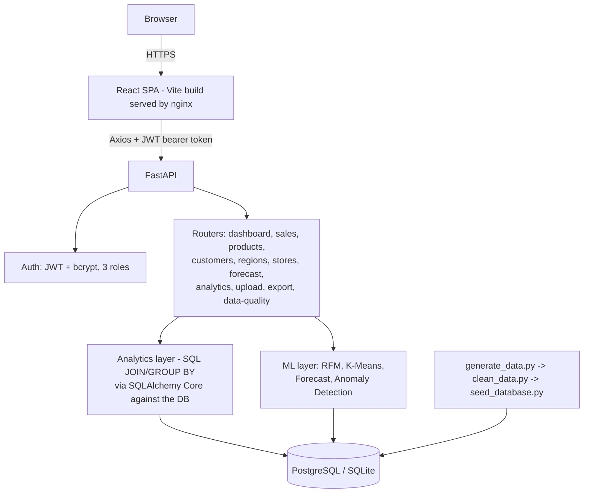
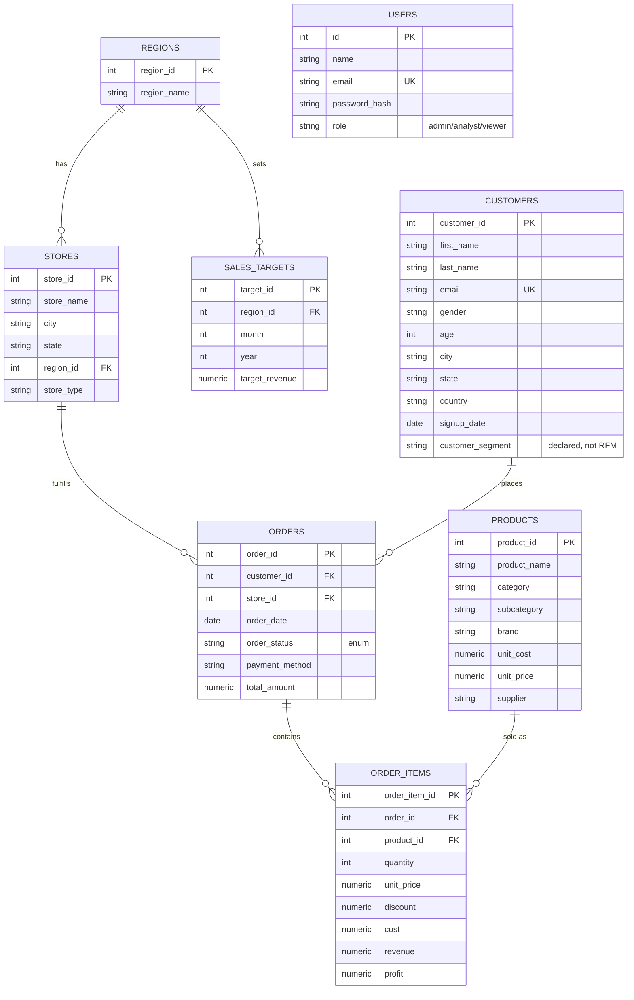

# RetailIQ — Retail Sales & Customer Analytics Platform

A full-stack retail analytics platform: synthetic data generation → cleaning
pipeline → PostgreSQL/SQLite → FastAPI + SQL analytics engine → ML (RFM,
K-Means, forecasting, anomaly detection) → React dashboard. Built as an
interview-ready portfolio project — every number on screen is computed from
a real database, not hardcoded.

## Overview

Retail and e-commerce companies generate large volumes of transactional data
— orders, customers, products, stores — but converting that data into
decisions management can act on is a real engineering problem: it requires
a clean data pipeline, a queryable schema, well-designed analytics, and a
UI that surfaces the signal (not just a dump of tables). RetailIQ builds
that whole pipeline end-to-end for a fictional retail company, from raw
synthetic data through to an interactive dashboard.

## Business Problem

A retail company's leadership can't easily answer questions like:
which regions and products are actually driving revenue and profit (not
just top-line sales), which customers are worth retaining, whether this
month's numbers are a real anomaly or normal seasonal noise, and what next
quarter is likely to look like. Spreadsheet exports don't scale, and a
one-off SQL query doesn't give managers self-serve access.

## Solution

RetailIQ ingests raw transactional data, validates and cleans it, stores it
in a normalized relational schema, and exposes it through a REST API backed
by real SQL aggregation — then layers statistical and ML analysis (RFM
segmentation, K-Means clustering, revenue forecasting, anomaly detection) on
top, all surfaced through a role-gated React dashboard with backend-driven
filtering (date range, region, store, category, customer segment).

## Key Features

- **Executive Overview** — 8 KPIs, 4 charts, and auto-generated
  business-insight sentences, all computed live from the filtered dataset.
- **Sales Analytics** — revenue/profit trends at 4 granularities, YoY/MoM-style
  period-over-period growth %, breakdowns by region/category/store.
- **Product Performance** — top/bottom N by revenue/profit/quantity,
  subcategory rollups, per-product detail pages.
- **Customer Analytics** — RFM analysis (rule-based, 7 segments) *and*
  K-Means clustering (ML-based, analyst-selectable k=3–6) side by side,
  paginated customer list, per-customer detail with order history.
- **Regional & Store Performance** — actual vs. target revenue, over/under
  performer callouts.
- **Sales Forecasting** — 30/60/90-day revenue forecast with a chronological
  train/test split, MAE/RMSE/MAPE, and feature importance.
- **Anomaly Detection** — day-of-week-aware statistical flagging of unusual
  revenue days, each with a plain-language explanation.
- **Data Quality dashboard** — the cleaning pipeline's own validation report
  (missing values, duplicates, invalid dates/quantities, rejection counts).
- **CSV Upload** — validate → preview → commit flow reusing the exact same
  cleaning logic as the offline pipeline.
- **CSV Export** on sales/products/customers.
- **JWT auth with 3 roles** (Admin, Analyst, Viewer) gating every analytics
  route and the upload endpoint.

## Technology Stack

| Layer | Choice |
|---|---|
| Frontend | React 19 + Vite + TypeScript + Tailwind CSS 4 + Recharts + React Router + Axios |
| Backend | Python 3 + FastAPI + Pydantic + SQLAlchemy 2.0 + Alembic |
| Database | PostgreSQL (production/Docker) or SQLite (zero-setup local dev) |
| Data / ML | pandas, NumPy, scikit-learn (RandomForestRegressor, KMeans, StandardScaler) |
| Auth | `python-jose` (JWT) + `bcrypt` (password hashing) |
| Testing | pytest (47 tests) against an isolated in-memory SQLite fixture |
| Containerization | Docker Compose (Postgres + backend + frontend/nginx) |

## Architecture



## System Flow

```
RAW DATA (synthetic, generate_data.py)
  -> VALIDATION + CLEANING (clean_data.py / app/services/data_cleaning.py)
  -> SQL DATABASE (PostgreSQL or SQLite, via seed_database.py)
  -> ANALYTICS (SQL aggregation in app/analytics/)
  -> ML (app/ml/: RFM, K-Means, forecast, anomaly detection)
  -> REST API (FastAPI routers, {success, data, message} envelope)
  -> DASHBOARD (React, backend-filtered, charted, exported)
```

## Database Schema



Indexes: `order_date`, `customer_id`, `product_id`, `store_id` (on `orders`),
`region_id` (on `stores`), `category` (on `products`) — chosen because these
are exactly the columns every analytics query filters or joins on.
`order_items.cost/revenue/profit` are stored, not computed on read — a
deliberate denormalization (like a data-warehouse fact table) so aggregation
queries can `SUM`/`GROUP BY` them directly.

## API Documentation

Full interactive docs at `http://localhost:8000/docs` (FastAPI's
auto-generated Swagger UI) once the backend is running. Summary:

| Method | Path | Notes |
|---|---|---|
| GET | `/api/health` | Public |
| POST | `/api/auth/register` | Public, always creates a Viewer account |
| POST | `/api/auth/login` | Public |
| GET | `/api/auth/me` | Requires auth |
| GET | `/api/dashboard/overview` | Composite KPIs + charts + insights |
| GET | `/api/sales/trends` | `?granularity=daily\|weekly\|monthly\|quarterly` |
| GET | `/api/sales/by-region` `/by-category` `/by-store` | |
| GET | `/api/products/top` `/bottom` | `?metric=revenue\|profit\|quantity` |
| GET | `/api/products/subcategories` | |
| GET | `/api/products/{id}` | 404 if unknown |
| GET | `/api/customers` | Paginated list |
| GET | `/api/customers/top` | |
| GET | `/api/customers/segments` | RFM segment summary |
| GET | `/api/customers/{id}` | Detail + order history + RFM |
| GET | `/api/regions` `/api/stores` | Incl. target achievement (regions) |
| GET | `/api/analytics/rfm` | Full RFM table |
| GET | `/api/analytics/kmeans-segments` | `?k=3..6` |
| GET | `/api/analytics/anomalies` | |
| GET | `/api/forecast` | `?horizon=30\|60\|90` |
| POST | `/api/data/upload` | Admin/Analyst only, multipart CSV |
| GET | `/api/data-quality/latest` | |
| GET | `/api/export/{sales,customers,products}` | CSV download |

Every analytics route requires a JWT (`Authorization: Bearer <token>`),
enforced via FastAPI router-level `dependencies=`. Every response follows
`{"success": bool, "data": ..., "message": str}`; errors follow
`{"success": false, "message": str, "errors": [...]}`. Query params are
validated by Pydantic/FastAPI (invalid enum values → 422).

## ML Methodology

**RFM Analysis** (`app/ml/rfm.py`) — Recency (days since last completed
order), Frequency (completed order count), Monetary (total revenue), each
scored 1–5 by quintile (`pd.qcut`) across the *whole* customer base (RFM
scores are inherently population-relative — there's no way to score one
customer without the full cohort). The three scores map to 7 business
segments (Champions, Loyal Customers, Potential Loyalists, New Customers, At
Risk, Lost Customers, Needs Attention) via an explicit rule table, unit
tested directly (`tests/test_rfm.py`).

**K-Means Segmentation** (`app/ml/kmeans_segmentation.py`) — an ML-driven
alternative view of the same customer base: recency/frequency/monetary/AOV,
standardized (`StandardScaler`) since K-Means is distance-based and these
features live on wildly different scales, then clustered with
analyst-selectable k (3–6). Cluster labels are computed from where each
cluster's centroid ranks on two independent axes (value tercile × engagement
tercile — e.g. "High-Value Active"), not a fixed lookup table, so labels stay
meaningful regardless of k.

**Sales Forecasting** (`app/ml/forecast.py`) — daily revenue aggregated from
completed orders, lag features (1/7/14/30-day) + rolling means (7/30-day) +
calendar features (day-of-week, month, trend index), `RandomForestRegressor`.
Evaluated with a **chronological** train/test split (last ~90 days held out
— never a random shuffle, which would leak future information into
training). MAE/RMSE/MAPE reported on the holdout; the model is then refit on
the *full* history and forecasts forward recursively — each future day's lag
features are built from actual history plus the model's own prior
predictions, since real lag values don't exist yet for future dates.
`lag_7` is consistently the most important feature, which tracks: retail
revenue correlates most with the same weekday the prior week.

**Anomaly Detection** (`app/ml/anomaly.py`) — day-of-week-aware rolling
z-score. Each day is compared only to the same weekday's last 8 occurrences
(not a blended all-days window, which would confound a routine busy Saturday
with a genuine anomaly), flagged if more than 2.5 standard deviations away.
Verified against 5 known-ground-truth anomaly days injected by
`generate_data.py` — all 5 detected.

## Data Pipeline

1. **`scripts/generate_data.py`** — synthetic dataset with a fixed seed:
   Zipf-like product popularity, heavy-tailed repeat-customer behavior,
   weekly/yearly/category seasonality, regional demand bias, a slow growth
   trend, and 5 deliberately injected anomaly days. A small, controlled
   fraction of rows are then corrupted (missing values, duplicates, bad
   casing/whitespace, invalid dates, invalid quantities) to mimic a messy
   real-world export, written to `data/raw/*.csv`.
2. **`scripts/clean_data.py`** — validates schema, detects/repairs the
   above (drops only what's truly unrecoverable — see Design Decisions),
   writes `data/processed/*.csv` plus `data_quality_report.json`. Shares its
   cleaning functions with the live upload endpoint via
   `app/services/data_cleaning.py`.
3. **`scripts/seed_database.py`** — bulk-loads the processed CSVs into the
   actual database plus 3 demo users. Idempotent (refuses to reseed a
   populated DB).

## Installation

Requires Python 3.11+ and Node.js 20+.

```powershell
git clone <repo-url> retailiq
cd retailiq
```

## Environment Variables

Copy `backend/.env.example` to `backend/.env`. All fields are optional with
sensible dev defaults:

| Variable | Default | Notes |
|---|---|---|
| `DATABASE_URL` | absolute path to `backend/retailiq.db` (SQLite) | Set to a `postgresql+psycopg2://...` URL for Postgres |
| `JWT_SECRET` | dev placeholder | **Change before any real deployment** |
| `JWT_ALGORITHM` | `HS256` | |
| `ACCESS_TOKEN_EXPIRE_MINUTES` | `60` | |
| `CORS_ORIGINS` | `http://localhost:5173` | Comma-separated |

## Database Setup

Defaults to SQLite — zero setup. For PostgreSQL, either run
`docker compose up` (see below) or point `DATABASE_URL` at your own instance,
then:

```powershell
cd backend
py -3 -m venv .venv
.venv\Scripts\pip install -r requirements.txt
.venv\Scripts\python -m alembic upgrade head
```

## Running Backend

```powershell
cd backend
.venv\Scripts\python -m uvicorn app.main:app --reload
```

Visit `http://localhost:8000/api/health` (should return
`{"success": true, ...}`) and `http://localhost:8000/docs` for the API
explorer.

## Running Frontend

```powershell
cd frontend
npm install
npm run dev
```

Visit `http://localhost:5173`. Sign in with one of the demo accounts below.

## Running Tests

```powershell
cd backend
.venv\Scripts\python -m pytest -v
```

47 tests against an isolated in-memory SQLite fixture (not the dev
database) — auth, every analytics router, invalid-input rejection, and
direct unit tests of the RFM classifier.

## Generating Dataset

A sample dataset (~10MB) is already committed under `data/raw/` and
`data/processed/`. To regenerate from scratch (same fixed seed → identical
data):

```powershell
backend\.venv\Scripts\python scripts\generate_data.py
backend\.venv\Scripts\python scripts\clean_data.py
```

## Loading Data

```powershell
backend\.venv\Scripts\python scripts\seed_database.py
```

### Demo accounts

**Development only — change before any real deployment.**

| Role | Email | Password | Can do |
|---|---|---|---|
| Admin | admin@retailiq.com | admin123 | View + upload + (future: manage users) |
| Analyst | analyst@retailiq.com | analyst123 | View + upload |
| Viewer | viewer@retailiq.com | viewer123 | View only |

## Screenshots

| Executive Overview | Sales Analytics |
|---|---|
|  |  |

| Customer Analytics (RFM + K-Means) | Customer Detail |
|---|---|
|  |  |

| Sales Forecasting | Anomaly Detection |
|---|---|
|  |  |

| Regional Performance | Data Quality |
|---|---|
|  |  |

## Future Enhancements

- Cache/precompute RFM and K-Means results as a nightly batch job instead of
  recomputing per request (fine at ~5k customers, wouldn't scale to millions).
- Per-store sales targets (currently region-level only, by schema design).
- A proper admin UI for user management (role changes currently require
  direct DB access).
- Prophet/STL-based forecasting to explicitly separate trend/seasonality/
  residual, which would likely reduce anomaly-detection false positives
  further.
- Log-scale (or split-out) the K-Means bar chart so an extreme outlier
  cluster doesn't visually dominate smaller clusters.
- CI pipeline (GitHub Actions) running pytest + frontend build on every push.
- E2E test suite (the Playwright walkthrough used to verify this build was
  ad-hoc, not committed as a repeatable suite).

## Project Structure

```
retailiq/
├── backend/
│   ├── app/
│   │   ├── main.py, config.py, database.py
│   │   ├── models/         # SQLAlchemy ORM models
│   │   ├── schemas/        # Pydantic request/response schemas
│   │   ├── routers/        # FastAPI route handlers
│   │   ├── services/       # business logic (insights, data cleaning)
│   │   ├── analytics/      # SQL aggregation functions
│   │   ├── ml/             # RFM, K-Means, forecast, anomaly detection
│   │   ├── auth/           # JWT + password hashing + role dependencies
│   │   └── utils/          # logging config
│   ├── tests/               # 47 pytest tests
│   ├── alembic/             # migrations
│   ├── requirements.txt
│   └── Dockerfile
├── frontend/
│   ├── src/
│   │   ├── pages/           # one file per route
│   │   ├── components/      # KpiCard, DataTable, FilterBar, charts/
│   │   ├── api/              # typed fetch functions + shared types
│   │   ├── context/          # AuthContext
│   │   └── lib/              # format helpers, chart color palette
│   └── Dockerfile
├── scripts/                  # generate_data.py, clean_data.py, seed_database.py
├── data/{raw,processed}/     # committed sample dataset
├── docs/screenshots/
├── docker-compose.yml
└── README.md
```

## Technical Challenges

Real bugs hit and fixed during development (each also logged inline where
they were fixed):

- **SQLAlchemy `Enum` persists Python enum *names*, not *values*, by
  default** — `OrderStatus.COMPLETED` would have been stored as
  `'COMPLETED'`, not `'completed'`, mismatching the lowercase strings used
  everywhere else. Fixed with `values_callable` before any real data existed.
- **A relative `DATABASE_URL` / `.env` path resolves against the *process's*
  working directory** — running a script from the repo root instead of
  `backend/` silently created a second, empty database file. Fixed by
  anchoring both to `Path(__file__)` in `app/config.py`.
- **Sales targets were calibrated to ~2.3x actual achievable revenue** —
  every region would have permanently shown ~40-50% target achievement.
  Recalibrated against the data's actual scale; now shows a believable
  88-102% spread.
- **A naive anomaly-detection baseline confounded weekly seasonality with
  real anomalies** — a routine busy Saturday looked like a "spike" against
  a 14-day window blending in quiet weekdays. Fixed by comparing each day
  only to the same weekday's recent history.
- **`sqlite:///:memory:` hands out a fresh, separate database per connection
  checkout, not per engine** — every test failed with a missing-table error
  until the test engine was pinned to `poolclass=StaticPool`.
- **A raw SQLAlchemy Core `INSERT` needs real `datetime.date` objects for
  `Date` columns** — the CSV upload's commit path threw on string dates from
  pandas until they were parsed immediately before the insert.
- **TypeScript interfaces without an index signature don't structurally
  satisfy `Record<string, unknown>`** — every chart/table component call
  site failed to compile until the relevant API types got an explicit
  `[key: string]: unknown`.

## Design Decisions

- **SQLite for local dev, PostgreSQL for production parity** — avoids
  requiring a PostgreSQL install for local development; models are written
  dialect-agnostic so switching is a one-line `DATABASE_URL` change.
- **`bcrypt` directly instead of `passlib`** — `passlib` is unmaintained with
  known compatibility breaks against modern `bcrypt` releases.
- **`Numeric(10,2)` for all currency columns**, not `Float` — avoids binary
  floating-point rounding errors on money values.
- **`customers.customer_segment` is a raw/declared attribute** (a marketing
  tier from source data), intentionally separate from the *behavioral*
  segment RFM computes from order history.
- **Revenue/profit/margin KPIs only count `completed` orders**, excluding
  cancelled/pending/returned — recognized revenue, not gross order value.
- **`customer_retention_rate` is the repeat-purchase rate** (% of purchasing
  customers with 2+ orders in the filtered window) — a simple, explainable
  proxy rather than a full cohort-retention curve, appropriate for one KPI
  card.
- **All analytics GET routes require authentication**, enforced via
  router-level `dependencies=` rather than annotating every endpoint.
- **Self-registered accounts are always Viewer role** — `/api/auth/register`
  ignores any role the client sends.
- **CSV export is fetched as an authenticated blob**, not a plain `<a href>`
  link, since export routes require a JWT a bare link can't carry.
- **Sample dataset CSVs are committed to git** (~10MB) rather than excluded
  — small enough that shipping it makes the repo usable immediately.
- **Rows are dropped only when the broken field is unrecoverable** (missing
  email, unparseable date, an impossible quantity, an exact duplicate key);
  everything else is repaired in place.

## Limitations

- RFM and K-Means recompute for the entire customer base on every request
  (well under a second at ~5k customers; wouldn't scale to millions without
  precomputation).
- Sales targets are region-level only, by schema design — no per-store
  target comparison.
- Docker Compose was reviewed and fixed carefully (migration-on-startup,
  SPA routing) but not run end-to-end, since Docker wasn't available in the
  environment this was built in.
- No CI pipeline yet; tests and build are run manually.
- Anomaly detection's z-score threshold produces some expected false
  positives on this non-stationary synthetic data (a real business would
  likely pair it with trend/seasonality decomposition).

## Author

Built as a portfolio project demonstrating full-stack architecture, SQL
analytics, and applied ML for a Technology Analyst / Technology Consulting
context.
